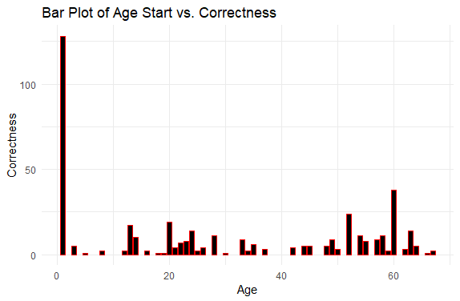

---
output:
  html_document: default
  pdf_document: default
---
# Introduction
Spanish and French are two languages that have been widely studied within in the field of Linguistics. Spain and France also share a border, having influenced each other over the centuries as well as having fought for power against one another. Both of Latin origin and romance languages, many are aware of the similarities between the two languages. One example of this is the verb “to sleep,” which translates to “dormir” in both Spanish and French. Similarly, French and Spanish form the periphrastic future (“I am going to __”) in the same way. The periphrastic future is formed in both languages by combining the verb “to go” and the preposition “to”, which in French, is implied when using an infinitive verb. Below are examples in both languages:

English: I am going to eat with a friend. (verb: to go)

French: Je vais manger avec une amie. (verb: aller)

Spanish: (Yo) voy a comer con una amiga. (verb: ir)

The CAES Corpus, also known as the Corpus de aprendices de Espanol, is a corpus from the Instituto Cervantes (Cervantes Institute) that compiled written data from L2 learners of Spanish. The L2 learners come from 11 different L1s, and in total, there are 56, 429 distinct morphemes.  The corpus is open to the public and allows anyone to search for any linguistic phenomenon (such as the periphrastic future) and filter it by Spanish Proficiency Level, L1, Country, Sex, Age, Student Number, Text Theme, and Type of Text.

Knowing the information at hand, the following research questions arise:
-	Does being an L1 speaker of French help L2 learners of Spanish acquire the periphrastic future better compared to L1 English Speakers?
-	What factors specifically affect, if at all, one’s ability to acquire periphrastic future in L2 Spanish?

# Data Collection

Acquiring the data in order to analyze it required doing multiple searches on the CAES corpus. The intention was to filter the results by those with either French or English as an L1, and I stuck to those who were in the lowest level of Spanish proficiency (A1). This is due to the fact that those who are at the lowest proficiency have had less time/experience learning Spanish, and therefore will have the least amount of influence from Spanish on their initial productions of the periphrastic future. These are the “purest” productions, one might say.

I split the search into more than just the inifinitive *ir* ‘to go’ plus the preposition *a* ‘to’ due to the fact that in general, multiple pronouns will be used in natural speech which would result in the production of the periphrastic future with several verb conjugations to match each pronoun. Therefore, there were several searches to accommodate each Spanish pronoun with its conjugation of *ir a*:

*Yo voy a*: I am going to

*Tu vas a*: You are going to

*El/Ella va a*: He/She/It is going to

*Nosotros vamos a*: We are going to

*Ellos van a*: They are going to

Five searches were done for L1 French speakers, and five more searches were done for L1 English speakers, resulting in a total of ten searches.

**Note**: The *a* was replaced by an asterik in the actual searches to allow for both correct and incorrect productions of the periphrastic future. It is possible for students to exclude the *a* or add extra words as they see fit.

The results from each corpus search provide each production of the desired linguistic phenomenon (The entire sentence is included) with further information about the student’s Spanish proficiency level, as well as their L1. These results can then be downloaded as csv or Excel files for analysis. I downloaded each search result as an Excel file. These were then individually imported into RStudio and combined into one large dataset for analysis.

# Results and Analysis

## Basic Statistical Analyses

I began my analysis with some basic statistics to understand the basis of the data set at hand.

There are a total of 48 students with French as their L1, with each participant having a different number of total productions. As for English, there are 35 total students with English as their L1. In total, we have 83 total students in this data set. There are also two types of written texts: e-mails and notes.

The `contacts` column in the data is meant for the students to relay whether they have any contacts who are Spanish speakers. There were a total of five distinct answers given from the 48 L1 French students:
1.	No contacts
2.	“Amigos” -> Friends
3.	“Amigos&Familiares” -> Friends and Family
4.	“Familiares” -> Family
5.	“Otros” -> Others

The data was filtered five times for each category of answers to how many tokens were accredited to each category of answers. The results show that the majority of students with L1 French had no contacts who are Spanish speakers (total of 25 students, 52%). The category with the smallest students is the “Friends” category, with a total of 10 students stating they have family members who are Spanish speakers, adding up to approximately 10% of the students in the data.
As for students with an L1 of English, there were a total of four distinct answers given from the 35 students:
1.	No contacts
2.	“Amigos” -> Friends
3.	“Amigos&Familiares” -> Friends and Family
4.	“Otros” -> Others

The results show that the majority of students with L1 English had no contacts who are Spanish speakers (total of 21 students, 60%). The category with the smallest students is the “Friends and Family” category, with a total of 2 students stating they have friends and family members who are Spanish speakers, adding up to approximately 5.7% of the students in the data.

## Logistic Regression

A separate data set was created (A1) in order to pull out all prescriptive productions of the periphrastic future. The way the data in the corpus was split meant there were three columns: one of any words that came before the verb *voy*, a column for the verb itself, and a third column that showed any words that came after the verb. Because the students' responses were words and did not involve numbers, the code was set to pick out sentences that included *a* and any word that ended in *-r*, since the formula for the periphrastic future is IR + a + infinitive.

A logistic regression was done using the data set with all correct productions to estimate the relationship between correctness and several independent variables: Current age (Age), Age when they starting learning Spanish (AgeStart), participant gender (Gender), country where the participant is from (Country), how many months they spent learning Spanish (Months), what level of school they were in when they started studying Spanish (Studies), if they know anyone who speaks Spanish (Contacts), and what their L1 is, French or English (L1).

Based on the regression the significant factors included: Age (p < 0.03949), AgeStart (p < 0.00638, highest), Being from Canada (p < 0.02321), Starting in Primary School (p < 0.04884), Starting in Uni (p < 0.02686, more than Primary). Based on these results, the age at which participants began to learn Spanish had the largest effect on their correctness productions of the periphrastic future in L2 Spanish. This is further supported by the fact that the estimate for AgeStart, 1.778e-02, is a positive number, meaning that the age at which participants started betters the odds of participants having correct productions. If the estimate were negative, then it would mean that the age at which they started learning decreases the odds of correct productions. It is important to note that specifically those who are from Canada had a significant effect on their productions. This makes sense, as French is one of the main languages spoken in Canada other than English, which further supports the data showing French has an important influence on periphrastic future production in L2 Spanish.

Almost Significant: Being from South Korea, having family members who speak Spanish, and having English as an L1.

Plot 1 shows that the largest number of correctness came from those who started learning Spanish from birth.

Plot 2 shows that those who were around 50 years old had the most correct answers.

Plot 3 shows that those who are from France had the most correct productions of the periphrastic future in French. Although interesting, it was Canada that had a significant effect on the correctness according to the logistic regression.

Plot 4 shows that those who started learning Spanish at their university had the most correct answers. The regression analysis shows that both those who started in primary school and at their university had the most significant effect on their correctness, with university learners having slightly more significance (about 0.02 more significance).

Plot 5 shows that those whose L1 is French had more correct answers. This actually answers my main research question, which was whether having French as an L1 allows one to have more correct productions than English speakers. According to the regression, having English as an L1 was *almost* significant. The negative estimate for L1 English means that having an L1 of English reduced the production of correct periphrastic future sentences.

# Conclusion

Based on the information provided above, both research questions were answered. First of all, having French as an L1 *does* in fact help participants produce the periphrastic future better than those who have English as an L1. As for the second question, the factors that affect periphrastic future production in L2 Spanish are the age when they started learning, their current age, whether or not they have any contacts who speak Spanish, what country they are from, what their L1 is, and what school they were in when they learned/started learning Spanish. The age when they started learning proved to be the most significant factor based on the logistic regression model. 

# Future Directions

In future studies of a similar nature, it would be interesting to compare different L1s, specifically those that are also under the romance language umbrella, such as Italian or Romanian, for example. Not only that, but it could be beneficial to perhaps explore motivations for learning L2 Spanish and see if that, compared with other factors, affects the participants' correct productions of the periphrastic future. More studies could certainly take this same structure but try to analyze a different grammatical phenmomenon that exists both in French and Spanish in the same way.

# Implications

This study reveals that knowledge of French has a strong potential to influence L2 Spanish learners. That being said, in terms of pedagogical resources, when teaching L2 Spanish to L1 French speakers, demonstrating the similarities between the languages either by a textbook or lecture will *help* the students learn Spanish rather than hinder them and make them confuse both languages.

# Process Notes
The most difficult aspect of this project was finding a corpus that included both Spanish and French. Initially, I wanted to find a corpus of L2 learners of French, but I had no luck, so I switched to L2 learners of Spanish, instead. The search required lots of test searches and playing around with the corpora to see if there was 1. L1 speakers of French and 2. Enough productions to do an analysis on. I also encountered a few issues due to the fact that there were no numbers in my data set, but rather words. I tried many different analyses such as regressions, correlations, etc. I had some guidance from classmates as well as the professor and was able to land on a logistic regression analysis that allowed me to derive statistical results from non-numerical data. I did make a big change towards the end of September, which resulted in the inclusion of the L1 English speakers as well. It was a very necessary addition, due to the fact that there was no way to make a comparison and truly know if L1 French had more of an affect on L2 Spanish periphrastic future if there was no other data set to compare it to.
