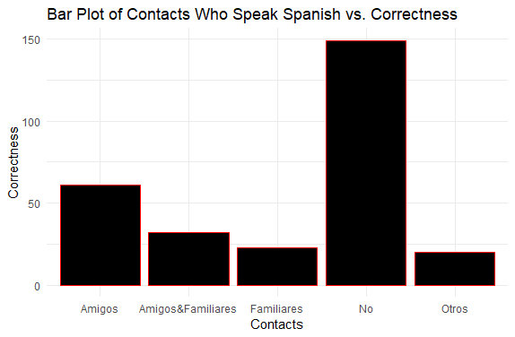

# Introduction

Spanish and French are two languages that have been widely studied
within in the field of Linguistics. Spain and France also share a
border, having influenced each other over the centuries as well as
having fought for power against one another. Both languages inherited
parts of speech from Latin: nouns, verbs, adjectives, adverbs,
prepositions, etc. Not only that, but both languages inflect their nouns
and verbs for gender and plurality. Part of this inflection, especially
on verbs, involves specific endings that must agree with person and
gender. On top of that, French and Spanish share many cognates (Lunn and
Alkhas, 2017, p. 10). One example of this is the verb *to sleep*, which
translates to *dormir* in both Spanish and French.

This particular study aims to analyze the similar periphrastic future
constructions (*I am going to \_\_*) of French and Spanish. More
specifically, whether having French as an L1 results in more correct
periphrastic future constructions in L2 Spanish. In order to know
whether or not L1 French *actually* helps, this study will include data
from L1 French *and* L1 English speakers for comparison purposes.

The examination of French learners of Spanish is important due to a lack
of information on this particular learner background. Although both
languages have been studied together, most empirical research that
exists is aimed at L1 English learners of both languages (Chenoweth et
al., 2006), Spanish learners of French (Beyer and Kluck, 1982),
accenting or stress in both languages (Barquero-Armesto, 2012; Dupoux et
al., 2008), etc. There is a need for further research on future
constructions using both languages with French being the participants'
L1, and the current study aims to fill in that gap.

The periphrastic future is formed in both French and Spanish by
combining the verb *to go* and the preposition *to*, followed by an
infinitive of a verb. In French, the preposition *to* is implied when
using an infinitive verb. English also has a similar future construction
of *go* + infinitive, making it a viable comparison for the study at
hand. Below are examples of the future tense in all three languages:

English: I am going to eat with a friend. (verb: to go)

French: Je vais manger avec une amie. (verb: aller)

Spanish: (Yo) voy a comer con una amiga. (verb: ir)

The CAES Corpus, also known as the Corpus de Aprendices de Español, is a
corpus from the Instituto Cervantes (Cervantes Institute) that compiled
written data from L2 learners of Spanish. The L2 learners come from 11
different L1s, and in total, there are 56, 429 distinct morphemes. The
corpus is open to the public and allows anyone to search for any
linguistic phenomenon (such as the periphrastic future) and filter it by
Spanish Proficiency Level, L1, Country, Sex, Age, Student Number, Text
Theme, and Type of Text.

Knowing the information at hand, the following research questions
arise: - To what extent does being an L1 speaker of French help L2
learners of Spanish acquire the correct productions of periphrastic
future better compared to L1 English Speakers? - What factors
specifically affect, if at all, one’s ability to acquire periphrastic
future in L2 Spanish?

This study will use the CAES corpus to analyze to what extent L1 French
affects acquisition of periphrastic future in L2 Spanish.

# Data Collection

Acquiring the data in order to analyze it required doing multiple
searches on the CAES corpus. The intention was to filter the results by
those with either French or English as an L1, and I stuck to those who
were in the lowest level of Spanish proficiency (A1). This is due to the
fact that those who are at the lowest proficiency have had less
time/experience learning Spanish, and therefore will have the least
amount of influence from Spanish on their initial productions of the
periphrastic future. These are the “purest” productions, one might say.

I split the search into more than just the infinitive *ir* ‘to go’ plus
the preposition *a* ‘to’ due to the fact that in general, multiple
pronouns will be used in natural speech which would result in the
production of the periphrastic future with several verb conjugations to
match each pronoun. Therefore, there were several searches to
accommodate each Spanish pronoun with its conjugation of *ir a*:

*Yo voy a*: I am going to

*Tu vas a*: You are going to

*El/Ella va a*: He/She/It is going to

*Nosotros vamos a*: We are going to

*Ellos van a*: They are going to

Five searches were done for L1 French speakers, and five more searches
were done for L1 English speakers, resulting in a total of ten searches.

**Note**: The *a* was replaced by an asterik in the actual searches to
allow for both correct and incorrect productions of the periphrastic
future. It is possible for students to exclude the *a* or add extra
words as they see fit.

The results from each corpus search provide each production of the
desired linguistic phenomenon (The entire sentence is included) with
further information about the student’s Spanish proficiency level, as
well as their L1. These results can then be downloaded as csv or Excel
files for analysis. I downloaded each search result as an Excel file.
These were then individually imported into RStudio and combined into one
large dataset for analysis.

# Results and Analysis

## Basic Statistical Analyses

I began my analysis with some basic statistics to understand the basis
of the data set at hand.

There are a total of 48 students with French as their L1, with each
participant having a different number of total productions. As for
English, there are 35 total students with English as their L1. In total,
we have 83 total students in this data set. There are also two types of
written texts: e-mails and notes.

Ages in the dataset range from 15 to 71 years old. Not only that, but
the age group with the most amount of students is the 61 year-olds who
have 13 total individuals. The age group with the least amount of
students is the 15, 18, 19, 24, and 44 year-olds who only had one
individual per age. The mean age is about 45 years old.

The `contacts` column in the data is meant for the students to relay
whether they have any contacts who are Spanish speakers. There were a
total of five distinct answers given from the 48 L1 French students: 1.
No contacts 2. *Amigos* -\> Friends 3. *Amigos&Familiares* -\> Friends
and Family 4. *Familiares* -\> Family 5. *Otros* -\> Others

The data was filtered five times for each category of answers to how
many tokens were accredited to each category of answers. The results
show that the majority of students with L1 French had no contacts who
are Spanish speakers (total of 25 students, 52%). The category with the
smallest students is the *Friends* category, with a total of 10 students
stating they have family members who are Spanish speakers, adding up to
approximately 10% of the students in the data. As for students with an
L1 of English, there were a total of four distinct answers given from
the 35 students: 1. No contacts 2. *Amigos* -\> Friends 3.
*Amigos&Familiares* -\> Friends and Family 4. *Otros* -\> Others

The results show that the majority of students with L1 English had no
contacts who are Spanish speakers (total of 21 students, 60%). The
category with the smallest students is the “Friends and Family”
category, with a total of 2 students stating they have friends and
family members who are Spanish speakers, adding up to approximately 5.7%
of the students in the data.

I needed to revise the dataset so that there was a `Correct` and
`Incorrect` column. The reason for this is that knowing what is
incorrect allows one to see what is prescriptive, or what is supposed to
be correct. Not including the incorrect occurrences would create an
analysis of frequency of periphrastic future usage, rather than
specifically how often the periphrastic was chosen when it could have
been something else. Once I did that, I double-checked all columns to
make sure that the Correct indications did not include anything that has
*ir* in the word, such as *Irlandes* which means *Irish*, not a
conjugation of *ir*.

Once I had two columns, one for Correct and one for Incorrect, then I
filtered out anyone who started learning Spanish at birth. This is
because they would be considered L1/Native speakers of Spanish if they
started at birth, not L2/Second language learners. I chose specifically
to filter out anyone who started learning at age 5 or later, because
Musliadi (2019) states that by five years old, a child understands the
semantics of language (p. 167). Anyone trying to produce language or
make conscious grammatical decisions, such as using the periphrastic
future, should be able to process and produce it correctly by the age of
five. Their L1 should be largely acquired by then, so the introduction
of another language would not be native/bilingual, but an L2.

After filtering, I ended up with a total of 57 participants who started
learning at or after the age of five. In total, there were 106 *correct*
productions of the periphrastic future and 178 *incorrect* productions.

## Logistic Regression

A logistic regression was done using the data set with all correct
productions to estimate the relationship between correctness and several
independent variables: Current age (Age), Age when they starting
learning Spanish (AgeStart), participant gender (Gender), country where
the participant is from (Country), how many months they spent learning
Spanish (Months), what level of school they were in when they started
studying Spanish (Studies), if they know anyone who speaks Spanish
(Contacts), and what their L1 is, French or English (L1). A binomial
logistic regression statistical analysis was chosen due to the fact that
there were only two possible answers from the participants, the Correct
("1") or the Incorrect ("0"). The prefix *-bi* in binomial suggests that
there are only two possible outcomes in the data set.

Based on the regression the significant factors included: Identifying as
a female (p \< 0.04741), participants being from France (p \< 0.00236),
participants being from South Korea (p \< 0.00147), participants being
from Canada (p \< 0.00153), participants being from Lebanon (p \<
0.03049), how many months participants spent learning Spanish (p \<
0.01681), *Other* studies (p \< 0.03262), having no contacts who know
Spanish (p \< 0.4635), and *Other* contacts. Based on these results, the
participants' country of origin had the most significant effect on
whether they had a correct production of the periphrastic future in L2
Spanish. For all four countries of origin that had significant effects
on periphrastic future production, all of their estimates were positive.
A positive estimate means that being from said country actually *helped*
the students produce the periphrastic future correctly.

For France and Canada, as they have French as a main language, this
supports the hypothesis that French has an important influence on
periphrastic future production in L2 Spanish. French is also widely
spoken in Lebanon.

As for South Korea, its significance is a very interesting and
unexpected result. There are only two participants from South Korea, but
their L1 is stated as being English. Both participants have no contacts
who know Spanish and had spent less than a year learning Spanish. It is
hard to say why exactly being from South Korea could positively
influence L2 Spanish. Because these participants did not state Korean as
being their L1 but rather English, it skews the analysis. Perhaps,
rather than South Korea as an origin country being significant, it would
make more sense to say that L1 English has a significant effect on the
periphrastic future in L2 Spanish because of the similarities between
the periphrastic future constructions of both languages. This would
require a separate, deeper analysis.

*Months* and *Studies* had negative estimates, meaning that yes, they
were significant, but the less months studied, the more incorrect
participants were. As for where students studied, if they marked
*Other*, rather than an institution, perhaps that means they
self-studied Spanish, or picked it up some other way that was not in an
educational, or prescriptive setting. A lack of structure such as one
would encounter in a classroom environment could affect how much and how
well a participant learns.

Plot 1 shows that participants who identified as women had higher rates
of correct productions of the periphrastic future compared to their male
counterparts. According to the binomial logistic regression, women
specifically had a positive estimate that significantly affected
periphrastic future production. Although a small estimate, because it is
positive, it demonstrates that being a woman results in more correct
productions of periphrastic future in L2 Spanish. Campbell, C. M., &
Shaw, V. M. (1994) discuss that between men and women who are second
language learners, men tend to have more anxiety about learning and
therefore do not perform as well (p. 228-229). Nyikos (1990) further
supports that women do better in second language learning because they
tend to be better with verbal skills, and they are able to sustain such
skills much more/better over time due to socialization processes (p.
273). Cross (1983) emphasizes that girls tend to have more positive
attitudes towards language learning and are higher achievers, although
he also stipulates that students learn better based on the gender of
their instructor who serves as a role model. The CAES corpus does not
include any information on participants' instructors, therefore one
cannot infer their role in the L2 Spanish acquisition process.

Plot 2 shows that participants from France had the most correct
productions of periphrastic future in L2 Spanish. This answers the first
research question about whether or not L1 French affects the
periphrastic future productions' correctness. Clearly we can see that it
does, and based on the positive and significant estimate in the binomial
logistic regression, being from France does in fact result in more
correctness.

Plot 3 shows that, surprisingly, those who studied Spanish for less than
two years had the most correct productions. Perhaps this is due to an
influx of prescriptive information in the first few years of language
acquisition.

Plot 4 shows that those who started learning Spanish at their university
had the most correct answers. The regression analysis shows that both
those who stated *Other* as their location of acquisition had a
significantly negative affect on periphrastic future productions,
meaning perhaps a lack of prescriptive instruction resulted in less
correctness overall.

Plot 5 shows that those who had no contacts who speak Spanish ended up
having the most correct productions of the periphrastic future. This is
an interesting result, considering one would assume exposure from others
to Spanish would improve one's understanding of a language. No contacts
and others (not explicitly stated who, maybe a partner or instructor)
were both significant factors. Their estimates in the binomial logistic
regression are positive, meaning having no contacts or having a contact
that is not friend or family results in more correctness. Perhaps the
introduction to Spanish from friends and/or family ended up confusing
participants instead when they began learning in school, or on their
own.

# Conclusion

Based on the information provided above, both research questions were
answered. First of all, having French as an L1 *does* in fact help
participants produce the periphrastic future better than those who have
English as an L1. As for the second question, the factors that affect
periphrastic future production in L2 Spanish are participant gender, the
country where participants are from, how many months participants
studied Spanish, where participants studied Spanish, and whether
participants had contacts who speak Spanish. The country where
participants are from proved to be the most significant factor of all
based on the binomial logistic regression.

# Future Directions

In future studies of a similar nature, it would be interesting to
compare different L1s, specifically those that are also under the
romance language umbrella, such as Italian or Romanian, for example. Not
only that, but it could be beneficial to perhaps explore motivations for
learning L2 Spanish and see if that, compared with other factors,
affects the participants' correct productions of the periphrastic
future. More studies could certainly take this same structure but try to
analyze a different grammatical phenmomenon that exists both in French
and Spanish in the same way.

# Implications

This study reveals that knowledge of French has a strong potential to
influence L2 Spanish learners. That being said, in terms of pedagogical
resources, when teaching L2 Spanish to L1 French speakers, demonstrating
the similarities between the languages either by a textbook or lecture
will *help* the students learn Spanish rather than hinder them and make
them confuse both languages. The *vosotros* pronoun should also be
included since it is taught prescriptively in L2 Spanish courses and is
used in Spain and some parts of South America.

# Process Notes

The most difficult aspect of this project was finding a corpus that
included both Spanish and French. Initially, I wanted to find a corpus
of L2 learners of French, but I had no luck, so I switched to L2
learners of Spanish, instead. The search required lots of test searches
and playing around with the corpora to see if there was 1. L1 speakers
of French and 2. Enough productions to do an analysis on. I also
encountered a few issues due to the fact that there were no numbers in
my data set, but rather words. I tried many different analyses such as
regressions, correlations, etc. I had some guidance from classmates as
well as the professor and was able to land on a logistic regression
analysis that allowed me to derive statistical results from
non-numerical data. I did make a big change towards the end of
September, which resulted in the inclusion of the L1 English speakers as
well. It was a very necessary addition, due to the fact that there was
no way to make a comparison and truly know if L1 French had more of an
affect on L2 Spanish periphrastic future if there was no other data set
to compare it to.

# Citations

Barquero-Armesto, M. Á. (2012). A comparative study on accentual
structure between Spanish learners of French interlanguage and French
native speakers. In *Speech Prosody 2012*.

Beyer, S. S., & Kluck, F. J. (1982). French via Spanish: a positive
approach to language learning for minority students. *Foreign Language
Annals*, *15*(2), 123-126.

Campbell, C. M., & Shaw, V. M. (1994). Language anxiety and gender
differences in adult second language learners: Exploring the
relationship.

Cross, David. (1983). Sex Differences in Achievement. System 11: 159-62.

Dupoux, E., Sebastián-Gallés, N., Navarrete, E., & Peperkamp, S. (2008).
Persistent stress ‘deafness’: The case of French learners of
Spanish. *Cognition*, *106*(2), 682-706.

Grolemund, G., & Wickham, H. (2017). R for Data Science. O’Reilly Media.

Lunn, P. V., & Alkhas, A. J. (2017). *Learning French from Spanish and
Spanish from French: A Short Guide*. Georgetown University Press.

Nyikos, M. (1990). Sex-Related Differences in Adult Language Learning:
Socialization and Memory Factors. *The Modern Language Journal*,
*74*(3), 273–287. <https://doi.org/10.2307/327624>

University of Santiago (2011-2022). *Corpus de Aprendices de Español*.
Available online at <https://galvan.usc.es/caes/search>.

Sánchez, G.R., & Martínez, I.M. (2016). Learner Spanish on computer: the
CAES "Corpus de Aprendices de Español" project.
